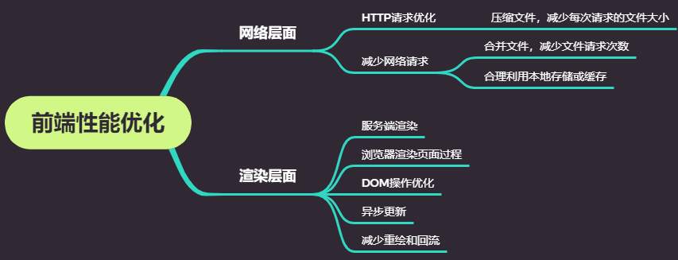
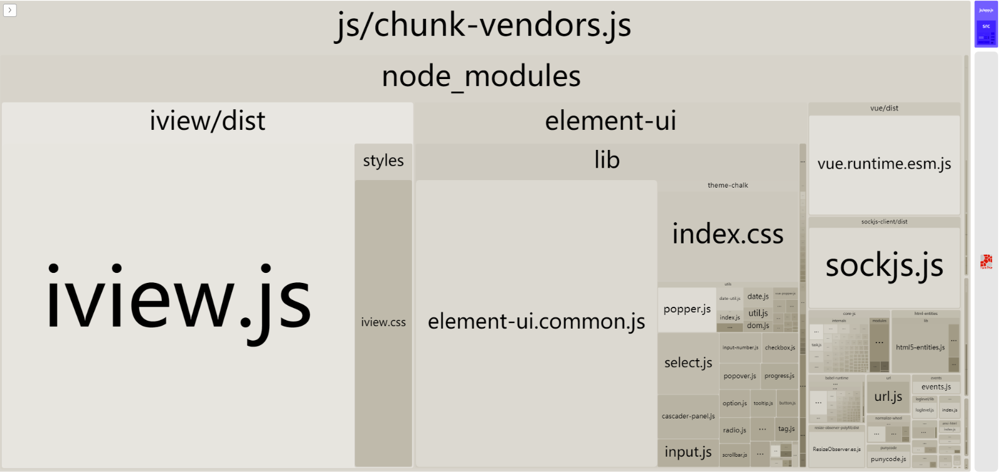
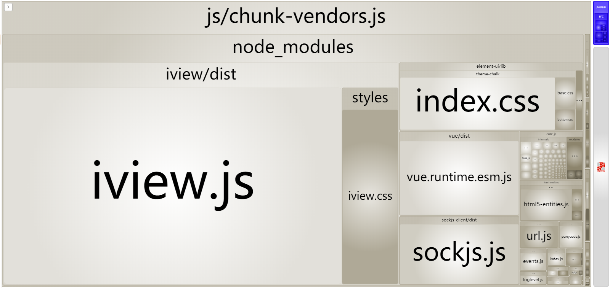
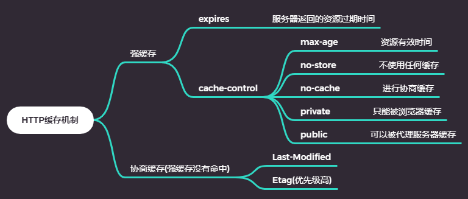
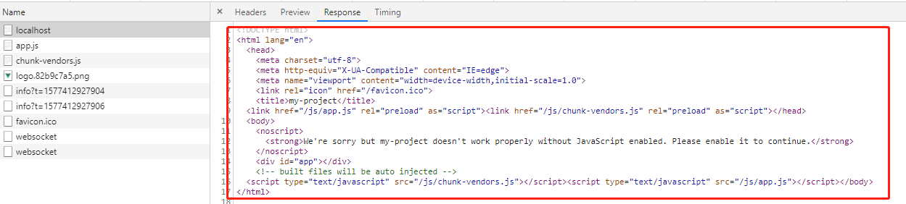
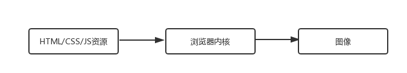
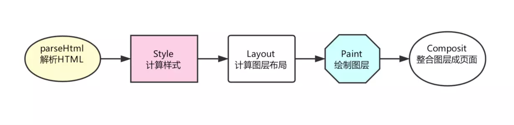
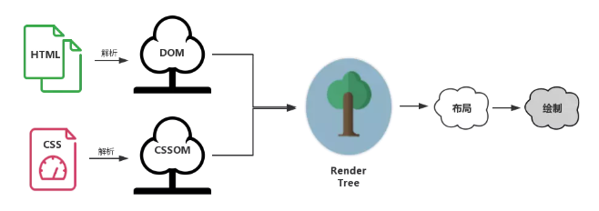
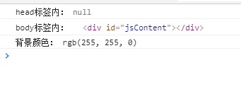
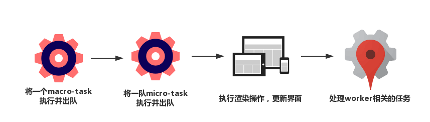

## 前端性能优化

从一个老生常谈的面试题开始：

> 浏览器地址从输入URL到页面加载完成，经历了什么

首先按顺序说明一下从输入URL到页面显示可能做的事：

- 1.DNS解析：将对应域名解析成服务器的ip地址和端口号
- 2.建立TCP网络连接：和ip地址对应的服务器建立TCP网络连接
- 3.发送HTTP请求：客户端向服务发送HTTP请求，获取需要的资源
- 4.处理HTTP请求：服务端接受到HTTP请求，处理相应的请求，将资源放到响应体中返回给客户端
- 5.获取数据，渲染页面：客户端获取到数据，解析响应内容，把解析结果展示给用户

接下来性能优化就是针对上面这五个过程分解，每个过程进行优化。</br>

对于前两个过程的优化，很遗憾我们所做的微乎其微，在这里就不谈了。剩下的三个过程优化我大致列了一个思维脑图。



### 网络层面优化

从上面的思维脑图我们可以看出，网络层面的优化可以从两方面入手：

- 减小单次请求文件的大小
- 减少请求次数

> 减小单次请求文件的大小

压缩文件在利用webpack前端工程化中已经帮我们做好了，我们在这里优化的点是怎么减小打包过后体积比较大的内容。在这里为大家推荐一个非常好用的包组成可视化工具--<a href="https://www.npmjs.com/package/webpack-bundle-analyzer">webpack-bundle-analyzer</a></br>



减小压缩后体积的方法：

- 1. 如使用组件库，尽量按需加载

- 2. 删除冗余代码（Tree-Shaking）：基于ES6的import语法，没有引用的模块不会被打包到最终代码中。

    - babel配置中设置：
        ```
        {
            presets: [['env', {modules: false}]]
        }
        ```
    - webpack在读取文件时会对没有用到的模块进行标记
    - uglify会处理代码过程中会根据标记来判断是否删除对应的代码

> 减少请求次数

我们可以合理的使用缓存来减少请求次数。对于我们来说http缓存是我们最为熟悉的。

> http缓存机制



> http缓存决策


当资源内容不可复用时，直接为cache-control设置为no-store,拒绝一切缓存；否则考虑是否每次都需要向服务器进行缓存的有效确认，如果需要，那么设置cache-control为no-cache; 否则考虑资源是否可以被代理服务器缓存，根据实际需要是设置为private还是public; 然后考虑资源的过期时间，设置对应的max-age; 最后配置协商缓存需要的Etag和Last-Modified。

### 渲染层面

这部分的内容是获取资源后浏览器展现内容方面的优化

> 服务端渲染




- 客户端渲染：浏览器执行一遍js，生成对应的dom节点；然后页面才呈现在用户面前
- 服务端渲染：后端把页面内容转化成HTML字符串返回给客户端，客户端拿到手就可以直接渲染呈现给用户

服务端渲染的优点：
    
- 加快首屏渲染速度
- 利于SEO

服务端渲染的缺点：

- 比较吃服务器资源

> 浏览器背后的运行机制

浏览器的内核分为两部分：

- 渲染引擎：
  * HTML解释器
  * CSS解释器
  * 布局
  * 网络
  * 存储
  * 图形
  * 音视频
  * 图片解码器
- JS引擎

> 浏览器渲染过程

浏览器的渲染过程，简单来说就是渲染引擎根据HTML文件描述构建相应的数学模型，然后调用浏览器相应零部件将网页资源代码转换成图像的结果，如下图所示：



在渲染过程中各个模块相互协作，下面列举我们比较关注的功能模块功能：

- HTML解释器：将HTML文件经过词法分析输出DOM树
- CSS解释器：解析CSS文件生成样式规则
- 图层布局计算模块：布局计算每个节点的精确位置和大小
- 视图绘制模块：进行具体节点的图像绘制，将像素渲染到屏幕上
- JavaScript引擎：编译执行JavaScript代码

>> 渲染过程解析

每个页面的首次渲染都经历如下阶段（下面每一个过程有可能是同步进行的）：



- 解析HTML：在这一步浏览器执行了所有的加载解析逻辑，在解析HTML的过程中发出页面渲染所需的各种外部资源请求
- 计算样式：浏览器加载并解析所有的样式信息与DOM树合并，生成最终的render树(::after, ::before这样的伪元素会被构建到DOM树中)
- 计算图层布局：计算页面中所有元素的相对位置信息，大小等
- 绘制图层：这一步浏览器会根据上面的结果把每一个图层转换为像素，并对所有的媒体文件进行解码
- 整合图层，得到页面：浏览器会合并各个图层，将数据由CPU输出给GPU最终绘制在屏幕上。

#### 渲染过程抽象成树

为了便于理解和记忆可以把渲染过程抽象成下面几颗重要的树：



- DOM树：解析HTML创建出DOM树；
- CSS树：解析所有的css(包括外部的css文件和样式元素)创建出css树，css的解析过程和DOM的解析过程是``并行的``
- render树：DOM树和CSS树结合得到render树
- 布局渲染树：递归遍历render树，计算每一个节点的大小、所在页面的精确位置等得到布局渲染树
- 绘制渲染树：遍历布局渲染树绘制每个节点

总结一下：浏览器的渲染过程，首先基于HTML构建DOM树，这棵DOM树与解析css生成的CSS树合并生成渲染树，通过布局和计算生成布局渲染树，浏览器以布局渲染树为基本去布局和绘制图像。

> 基于渲染过程的CSS优化

看如下css代码：

	#myList li {
    	float: left;
	}

大家在写的过程会本能的以为浏览器寻找起来并不困难，因为#myList是一个id选择器对应的元素应该只有一个，查找起来很简单，定位到#myList元素等于缩小了范围之后再去查找它后代中的li元素就比较简单了。但是，事实上``CSS选择符是从右到左进行匹配的``，也就是浏览器先遍历页面中的每一个li元素，然后再去确认它的父级有没有#myList，所以上面这种写法性能就比较差了。</br>
下面就总结基于css的性能提升方案：
- 避免使用通配符，只对需要用到的元素进行选择
- 了解可以被继承实现的属性，避免重复匹配重复定义
- 少用标签选择器，尽量使用类选择器。
- 减少嵌套，尽量将深度降到最低。

> CSS和JS加载顺序优化

`CSS`和`JS`都会阻塞上面所说的渲染过程。

#### CSS的阻塞

在上面说明浏览器渲染过程时，提到渲染树是有DOM树和CSS树合力生成的；所以即便DOM已经解析完成，只要CSS树没有完成，用户还是见不到页面的。因此我们可以得出以下优化方案：
- 尽早加载CSS，就是我们现在常做的将CSS相关放在head标签中
- 尽快加载CSS，比如加载外部CSS时，使用CDN加快加载速度

#### JS阻塞

我们一起来看下面的例子：

	<!DOCTYPE html>
	<html lang="en">
	<head>
	    <meta charset="UTF-8">
	    <meta name="viewport" content="width=device-width, initial-scale=1.0">
	    <meta http-equiv="X-UA-Compatible" content="ie=edge">
	    <title>JS阻塞</title>
	    <style>
	        #jsContent {
	            background-color: rgb(255, 255, 0);
	        }
	    </style>
	    <script src="./headIndex.js"></script>
	</head>
	<body>
	    <div id="jsContent"></div>
	    <script src="./bodyIndex.js"></script>
	    <style>
	        #jsContent {
	            background-color: rgb(0, 255, 255);
	        }
	    </style>
	</body>
	</html>
	
	// headIndex.js
	console.log('head标签内：', document.querySelector('#jsContent'));
	// bodyIndex.js
	const dom = document.querySelector('#jsContent');
	console.log('body标签内：', dom);
	console.log('背景颜色：', window.getComputedStyle(dom).backgroundColor);

输出结果：



从结果来看js阻塞了DOM树和CSS树的生成，也就阻塞了页面渲染，为了避免不必要的js阻塞，我们可以使用async和defer来进行优化：

- async: async模式下不会阻塞浏览器做其他事情，异步加载js，加载结束后立即执行
- defer: defer模式下也不会阻塞浏览器做其他事前，异步加载js，等整个文档解析完成、DOMContentLoaded事件即将被触发时，defer标记的js才开始执行

或者像我们平常做的一样将js放在body最后去引用

> DOM操作优化

雅虎军规中很重要的一条就是：`尽量减少DOM访问`；那么为什么DOM会这么慢呢？因为收了"过路费";

>> 把DOM和JavaScript各自想象成一个岛屿，它们之间用收费桥梁连接。---《高性能JavaScript》

当我们每访问一次DOM时都会过一次桥，当操作次数过多时就会产生明显的性能问题。

#### 修改DOM引发的样式变化

过桥很慢，到了桥对岸更改操作带来的结果也很慢。很多时候我们对DOM的操作不局限于访问，而是修改它，引发外观上的改变触发回流或重绘。本质上就是我们对dom树的改变造成渲染树的改变所致。

- 回流：当我们对DOM的修改引发DOM的几何尺寸或位置改变时，浏览器会重新计算元素的几何属性，然后再将计算结果绘制出来，这个过程就叫做回流。
- 重绘：当我们的修改导致了DOM元素的样式修改时(比如修改了字体颜色或者背景色)，并未造成元素的几何属性改变时，浏览器不需要重新计算元素的几何属性，直接为元素绘制样式，这个过程就叫做重绘。

#### 优化DOM：减少DOM操作、避免过度渲染

我们一起来看一个例子：

	<!DOCTYPE html>
	<html lang="en">
	<head>
	  <meta charset="UTF-8">
	  <meta name="viewport" content="width=device-width, initial-scale=1.0">
	  <meta http-equiv="X-UA-Compatible" content="ie=edge">
	  <title>DOM操作测试</title>
	</head>
	<body>
	  <div id="jsContainer"></div>
	</body>
	</html>

此时假如有个需求：想要在jsContainer里面写1000句一样的话。可以这样做：


	for(let count = 0; count < 1000; count++) {
	    document.getElementById('jsContainer').innerHTML += '<span>这是一个测试</span>';
	}

大家看到这段代码，会发现有两个明显的优化点：

- 第一访问太多次dom了，每一次循环都访问了一次jsContainer元素，总共访问了1000次，其实可以用个变量缓存下来，只访问一次

	const dom = document.getElementById('jsContainer');
	for(let count = 0; count < 1000; count++) {
	    dom.innerHTML += '<span>这是一个测试</span>';
	}

- 第二不必要的dom更改太多了，在这1000次循环中修改了1000次dom树，从而造成了1000次回流或重绘，这是很影响性能。其实我们可以只改变一次dom树：

	const dom = document.getElementById('jsContainer');
	let content = '';
	for(let count = 0; count < 1000; count++) {
	    content += '<span>这是一个测试</span>'
	}
	dom.innerHTML = content;

从上面我们可以看出减少DOM操作的核心思路就是让``JS去给DOM分压``

#### 优化DOM：异步更新策略

Vue内部就是利用异步更新实现DOM的优化。在介绍异步更新之前先介绍一下EVent Loop和渲染时机

> Event Loop和渲染时机

Event Loop分为两种：

- Macro-Task(宏任务)：常见的宏任务有setTimeout、setInterval、setImmediate、script(整体代码)
- Micro-Task(微任务)：常见的微任务有Promise

一个完整Event Loop过程可以概括为以下阶段：
	
- 初始状态：调用栈为空。只有一个script脚本
- script脚本被推入到调用栈，执行同步代码。在执行过程中可能会产生宏任务与微任务，它们会被分别推入到对应的任务队列里，当所有的同步代码执行完毕之后，script脚本移出宏队列
- 如果微任务队列不为空，按推入顺序依次执行，直到执行完所有的微任务。
- ``执行渲染操作，更新界面``
- 检查是否存在Web worker任务，如果有的话进行处理
（上述过程循环往复，直到两个队列都为空）
总结一下，每次循环都是下面这样一个过程：



通过上面的事件循环过程我们可以知道异步更新DOM的最佳时机应该在微任务队列中。那么为什么使用异步更新呢？

> 异步更新的好处

因为异步更新只考虑结果，不会为过程买单，例如下面一个Vue的例子：


	// 同步任务1
	this.content = 1;
	// 同步任务2
	this.content = 2;
	// 同步任务3
	this.content = 3;

试想一下，如果Vue不是异步更新的话，会出现三次修改dom情况，但是本质上只有最后一次的修改是有意义，这样就白白浪费了两次修改。但是如果使用异步更新的话它们会先在JS层面上被批量完成，当渲染时仅仅需要针对有意义的计算结果去操作dom一次。<br/>

$nextTick大家应该都很熟悉，Vue内部实现这个方法用来进行异步更新。我们一起来看一个例子：

	// html
	<ul>
	    <li v-for="(item, index) in list" :key="index" class="fd-list-item">{{item}}</li>
	    <button @click="addClickHandler"></button>
	</ul>
	// js
	{
	    data () {
	        return {
	            ...
	            list: [1, 2, 3, 4, 5]
	        };
	    },
	    methods: {
	        addClickHandler () {
	            this.list.push(this.list.length + 1);
	            this.$nextTick(() => {
	                console.log(document.querySelectorAll('.fd-list-item'))
	            })
	        }
	    }
	}

> Vue异步更新的模拟实现-nextTick


	function nextTick(cb, ctx) {
		let _resolve
		callbacks.push(() => {
			if (cb) {
				cb.call(ctx);
			} else if (_resolve) {
				_resolve(ctx)
			}
		})
		if (!pending) {
			microTimerFunc()
		}
		if (!cb) {
			return new Promise(resolve => {
				_resolve = resolve;
			})
		}
	}
	
	function microTimeFunc() {
		const p = Promise.resolve();
		return () => {
			p.then(flushCallbacks)
		}
	}
	
	function flushCallbacks() {
		pending = false;
		const copies = callbacks.slice(0);
		callbacks.length = 0;
		copies.forEach(fn => {
			fn()
		})
	}

#### 优化DOM：减少回流和重绘

重绘比较好识别比如修改DOM的样式信息例如文字颜色、背景颜色、可见性(这里指的是visibility属性)。这里想重点说一下哪些操作会触发回流

> 回流操作

- 改变DOM的几何属性：当一个元素的几何属性改变时会它相关的节点(比如父子节点、兄弟节点)的几何属性都需要重新计算。常见的几何属性有：
    - width
    - height
    - margin
    - padding
    - left
    - top
    - border
- 改变DOM树结构：增加、删除、移动节点
- 获取特定属性值：在平常开发中我们可能会使用如下属性：
    - offset
    - scroll
    - client
这些属性值有一个共性就是`即时性`,当每次获取时，浏览器都会进行回流

> 如何减少回流和重绘

- 避免频繁改动

	const dom = document.getElementById('fd-wrap');
	for (let i = 0; i < 10; i++) {
	    el.style.top = `${el.offsetTop + 10}px`;
	}

优化：可以使用js变量将值缓存起来

	const dom = document.getElementById('fd-wrap');
	let offsetTop = dom.offsetTop;
	for(let i = 0; i < 10; i++) {
	    offsetTop += 10;
	}
	dom.style.top = `${offsetTop}px`;


- 避免逐条修改样式


	const container = document.getElementById('jsContainer')
	container.style.width = '100px'
	container.style.height = '200px'
	container.style.border = '10px solid red'
	container.style.color = 'red'

优化：增加类名，在css中编写相应的样式

	// css
	.fd-container {
	    width: 100px;
	    height: 200px;
	    border: 10px solid red;
	    color: red;
	}
	// js
	const container = document.getElementById('jsContainer');
	container.classList.add('fd-container');

- 将DOM“离线”

DOM离线就是将在修改DOM之前先设置display: none,相当于把DOM元素从页面上拿掉了，后续对该DOM的操作就不会触发回流和重绘。例如：

	const container = document.getElementById('jsContainer');
	container.style.display = 'none';
	container.style.width = '100px'
	container.style.height = '200px'
	container.style.border = '10px solid red'
	container.style.color = 'red'
	container.style.display = 'block'

这样中间我们不管操作多少次该DOM，最终我们只会触发两次回流