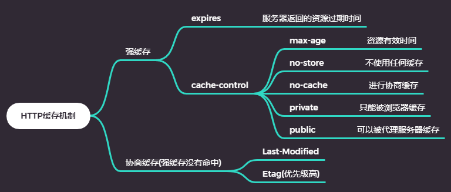
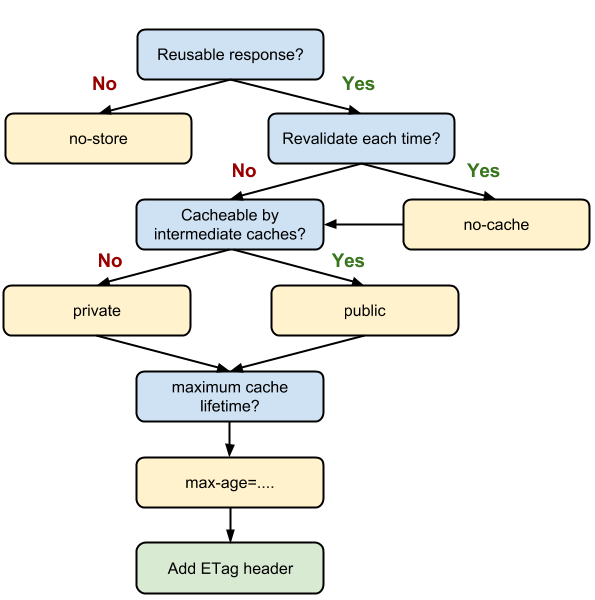

## 前端性能优化

从一个老生常谈的面试题开始：

> 浏览器地址从输入URL到页面加载完成，经历了什么

首先按顺序说明一下从输入URL到页面显示可能做的事：

- 1.DNS解析：将对应域名解析成服务器的ip地址和端口号
- 2.建立TCP网络连接：和ip地址对应的服务器建立TCP网络连接
- 3.发送HTTP请求：客户端向服务发送HTTP请求，获取需要的资源
- 4.处理HTTP请求：服务端接受到HTTP请求，处理相应的请求，将资源放到响应体中返回给客户端
- 5.获取数据，渲染页面：客户端获取到数据，解析响应内容，把解析结果展示给用户

接下来性能优化就是针对上面这五个过程分解，每个过程进行优化。 

对于前两个过程的优化，很遗憾我们所做的微乎其微，在这里就不谈了。剩下的三个过程优化我大致列了一个思维脑图。

### 网络层面优化

从上面的思维脑图我们可以看出，网络层面的优化可以从两方面入手：

- 减小单次请求文件的大小
- 减少请求次数

> 减小单次请求文件的大小

压缩文件在利用webpack前端工程化中已经帮我们做好了，我们在这里优化的点是怎么减小打包过后体积比较大的内容。在这里为大家推荐一个非常好用的包组成可视化工具--<a href="https://www.npmjs.com/package/webpack-bundle-analyzer">webpack-bundle-analyzer</a> 

减小压缩后体积的方法：
- 1. 如使用组件库，尽量按需加载
- 2. 拆分资源
- 3. 删除冗余代码（Tree-Shaking）

> 减少请求次数

我们可以合理的使用缓存来减少请求次数。对于我们来说http缓存是我们最为熟悉的。

> http缓存机制

> http缓存决策

当资源内容不可复用时，直接为cache-control设置为no-store,拒绝一切缓存；否则考虑是否每次都需要向服务器进行缓存的有效确认，如果需要，那么设置cache-control为no-cache; 否则考虑资源是否可以被代理服务器缓存，根据实际需要是设置为private还是public; 然后考虑资源的过期时间，设置对应的max-age; 最后配置协商缓存需要的Etag和Last-Modified。

### 渲染层面

这部分的内容是获取资源后浏览器展现内容方面的优化

> 服务端渲染

- 客户端渲染：浏览器执行一遍js，生成对应的dom节点；然后页面才呈现在用户面前
- 服务端渲染：后端把页面内容转化成HTML字符串返回给客户端，客户端拿到手就可以直接渲染呈现给用户

服务端渲染的优点：
    
- 加快首屏渲染速度
- 利于SEO